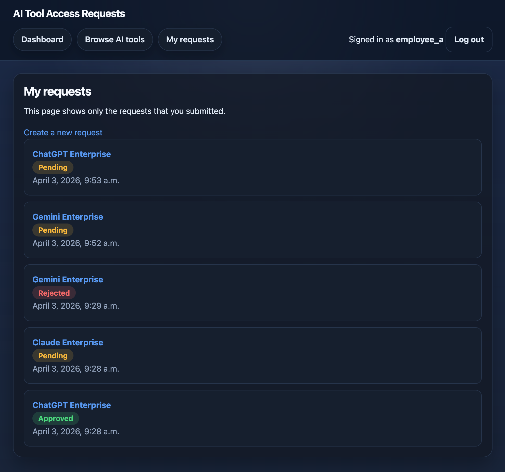
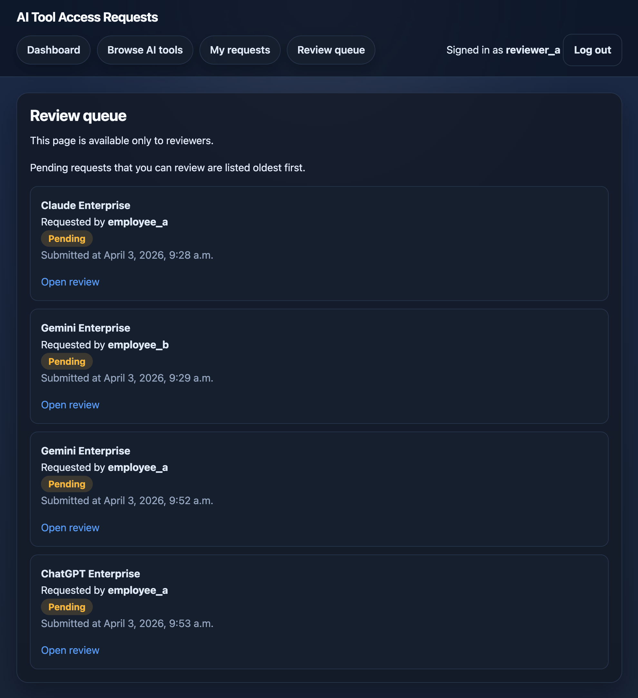

# ai-tool-access-requests

> 日本語版: [README.ja.md](README.ja.md)

A minimal Django + PostgreSQL internal workflow application for requesting and reviewing access to enterprise AI tools.

This repository is a portfolio project built to demonstrate practical backend fundamentals with Django: authentication, authorization, relational modeling, form validation, class-based views, operational admin design, and test-backed protection of core business rules. The scope is intentionally small, but the workflow is meant to resemble a realistic internal business application rather than a generic CRUD demo.

The screenshots below show the two main user perspectives in the application: requester-facing request tracking and reviewer-facing review workflow.

## UI preview

| Requester-facing view | Reviewer-facing view |
| --- | --- |
|  |  |
| *Tracking submitted requests and their current statuses from the requester-facing view.* | *Reviewing pending requests through a dedicated reviewer-facing queue, ordered oldest first.* |

## What this project demonstrates

- Practical use of Django built-in features
- Authentication and authorization with role-aware behavior
- Relational modeling with PostgreSQL
- Request and review workflow design
- Form validation and server-side business rule enforcement
- Clear separation between requester-facing, reviewer-facing, and admin responsibilities
- Inspection-only admin design for sensitive workflow records
- A focused automated test suite that protects the application's core behavior against regressions

## Project overview

In this application:

- an authenticated user can browse an internal catalog of AI tools
- a requester can submit an access request for an active tool
- a requester can view only their own submitted requests
- a reviewer can inspect pending requests and approve or reject them
- Django admin is used for operational maintenance and safe inspection, not as an alternate workflow execution surface

The project keeps the domain model intentionally minimal:

- Django built-in `User`
- `AITool`
- `AccessRequest`

It also keeps the role model explicit:

- **requester**: a normal authenticated user
- **reviewer**: a user in `Group(name="reviewer")`
- **admin operator**: a user with `is_staff=True` for Django admin access
- **system owner**: a superuser with full system permissions

This separation is deliberate. Business workflow roles and Django system flags are treated as related but distinct concerns.

## Core workflow

1. An authenticated user browses the active AI tool catalog.
2. The user submits an access request with a purpose and business justification.
3. The requester can view only their own submitted requests and current status.
4. A reviewer sees a pending review queue, excluding their own requests.
5. The reviewer approves or rejects the request through a dedicated review UI.
6. Django admin is used to maintain the tool catalog and inspect request records in a safe, view-only manner.

## Key business rules

This project is intentionally small, but it includes several important workflow boundaries:

- **Requester-facing and reviewer-facing routes are separated**
  - `/requests/<pk>/` is owner-only
  - `/reviews/<pk>/` is reviewer-only

- **Self-review is forbidden**
  - reviewers cannot review their own submitted requests
  - self-owned pending requests are excluded from the review queue
  - direct review access and review POST actions are denied for self-review attempts

- **Only pending requests are reviewable**
  - once approved or rejected, the same request cannot be reviewed again

- **Duplicate pending requests are prevented**
  - the same user cannot hold multiple simultaneous `pending` requests for the same tool
  - this is protected both at the form layer and at the database layer

- **Inactive tools are not requestable**
  - inactive tools are hidden from requester-facing flows
  - manual POST attempts using inactive tools are rejected server-side

- **Admin is inspection-oriented**
  - `AITool` is operationally managed in Django admin
  - `AccessRequest` is treated as inspection-only in admin
  - request approval or rejection is not executed through admin

The goal is to show not just CRUD mechanics, but careful handling of permission boundaries and workflow safety.

## Why the test suite matters

This repository includes a **minimal but meaningful automated test suite** focused on the parts of the application that are most likely to break the workflow when the code evolves.

The aim is not broad but shallow coverage. Instead, the test suite focuses on protecting the core business rules:

- form validation
- requester and reviewer route separation
- permission boundaries
- self-review prohibition
- inactive tool handling
- model-level consistency
- database-backed duplicate pending protection
- inspection-only admin behavior

The tests are organized by responsibility:

- `test_forms.py`
  - input validation
  - inactive tool rejection
  - duplicate pending request rejection
  - rejection comment requirement

- `test_views.py`
  - route protection
  - role-aware access control
  - requester and reviewer flow boundaries
  - approval and rejection workflow behavior
  - re-review prevention
  - self-review protection

- `test_models.py`
  - status choices
  - model consistency validation
  - database constraint behavior for duplicate pending requests

- `test_admin.py`
  - permission boundaries in Django admin
  - inspection-only behavior for `AccessRequest`
  - protection against admin-side workflow bypass

In other words, the test suite is intentionally aimed at reducing the chance that routine refactors or feature changes will break request creation, review execution, permission boundaries, or admin safety.

## Current test status

- 52 tests passing

This reinforces the main quality goal of the project: protecting core workflow behavior while keeping the application intentionally small.

## Tech stack

- Python 3.13
- Django 6.0
- PostgreSQL
- psycopg 3
- uv
- Django templates and forms
- Django admin

## Architecture notes

### Minimal domain model

The project uses a deliberately small relational model centered on `ForeignKey` relationships:

- `AccessRequest.requester -> User`
- `AccessRequest.reviewed_by -> User`
- `AccessRequest.ai_tool -> AITool`

This keeps the initial release easy to reason about while still supporting a realistic request and review workflow. Future extensions such as employee profiles, reviewer scopes, or classification tags are intentionally deferred.

### Layer responsibilities

The project deliberately spreads responsibilities across layers:

- **model and database layer**
  - structural consistency
  - constraints
  - referential integrity

- **form layer**
  - input validation
  - duplicate detection for user feedback
  - rejection comment requirement

- **view layer**
  - authentication and authorization
  - object-level access control
  - workflow execution
  - safe handling of review decisions

- **admin layer**
  - operational visibility
  - catalog maintenance
  - safe inspection rather than workflow execution

This separation is important because the project is meant to show that backend design is not only about making pages work, but also about assigning rules to the correct layer.

## Local setup

### Prerequisites

- Python 3.13
- PostgreSQL running locally
- `uv`

For v0.1.0, PostgreSQL is expected to run locally rather than through Docker.

### Install dependencies

```bash
uv sync
```

### Configure environment variables

Create a local environment file from `.env.example` and set values that match your local setup.

One possible example:

```bash
cp .env.example .env.local
set -a
source .env.local
set +a
```

Expected database-related settings are:

```env
DB_NAME=your_db_name
DB_USER=your_db_user
DB_PASSWORD=your_db_password
DB_HOST=127.0.0.1
DB_PORT=5432
DJANGO_SECRET_KEY=replace-this-with-a-real-secret
```

### Apply migrations

```bash
uv run python manage.py migrate
```

### Create a superuser

```bash
uv run python manage.py createsuperuser
```

### Run the development server

```bash
uv run python manage.py runserver
```

## Initial reviewer and admin setup

After logging into Django admin:

1. Create a group named `reviewer`
2. Create or select a user who should act as a reviewer
3. Add that user to the `reviewer` group
4. Use `is_staff=True` only for users who should access Django admin
5. Grant the built-in model view permission where inspection access is needed in admin

This project intentionally does **not** treat `is_staff` alone as equivalent to reviewer permission. Review capability belongs to the business workflow role, not to admin access alone.

## Creating sample AI tools

You can create sample tools through Django admin.

Recommended example fields:

- `code`: URL-safe stable slug
- `name`: product name
- `vendor`: vendor name
- `description`: short internal description
- `homepage_url`: official product page
- `is_active`: active or inactive flag

Normal operation is based on **soft deactivation** with `is_active=False` rather than deleting tools.

## Running tests

Run the full automated test suite with:

```bash
uv run pytest
```

Optional check:

```bash
uv run python manage.py check
```

The tests are intentionally focused on core workflow safety rather than cosmetic behavior. They are meant to catch regressions in the parts of the app that matter most:

- request creation rules
- review permission boundaries
- self-review prohibition
- model and database consistency
- admin-side safety

## Scope and non-goals

The scope is intentionally constrained to keep the project minimal and coherent.

### Included in v0.1.0

- AI tool catalog browsing
- access request creation
- requester-facing request list and detail
- reviewer approval and rejection flow
- Django admin for catalog maintenance and safe request inspection

### Explicitly out of scope

- self-signup
- email notifications
- Slack notifications
- multi-step approval
- dedicated audit log table
- external API integrations
- public API
- Django REST Framework
- Docker and Docker Compose
- JavaScript-heavy rich UI
- custom user model

These exclusions are intentional. The goal of the project is to show a disciplined minimum viable product with realistic backend boundaries, not to maximize feature count.

## Future improvements

Natural next steps after this minimum viable product would include:

- invite-based onboarding or password-reset-driven account activation
- audit logging for sensitive workflow actions
- multi-step approval flows
- notifications
- reviewer scope extensions
- department or employee profile modeling
- an API layer for external integration
- deployment-oriented production hardening

## Why this project exists as a portfolio piece

This repository is meant to demonstrate that I can build a small but credible backend application with:

- a clear domain model
- explicit workflow rules
- practical Django conventions
- careful permission design
- operational awareness around admin usage
- focused tests that protect core behavior over time

The emphasis is on correctness, separation of concerns, and regression resistance in a realistic internal workflow, not on maximizing feature count or frontend complexity.

## License

MIT License. See `LICENSE` file.
